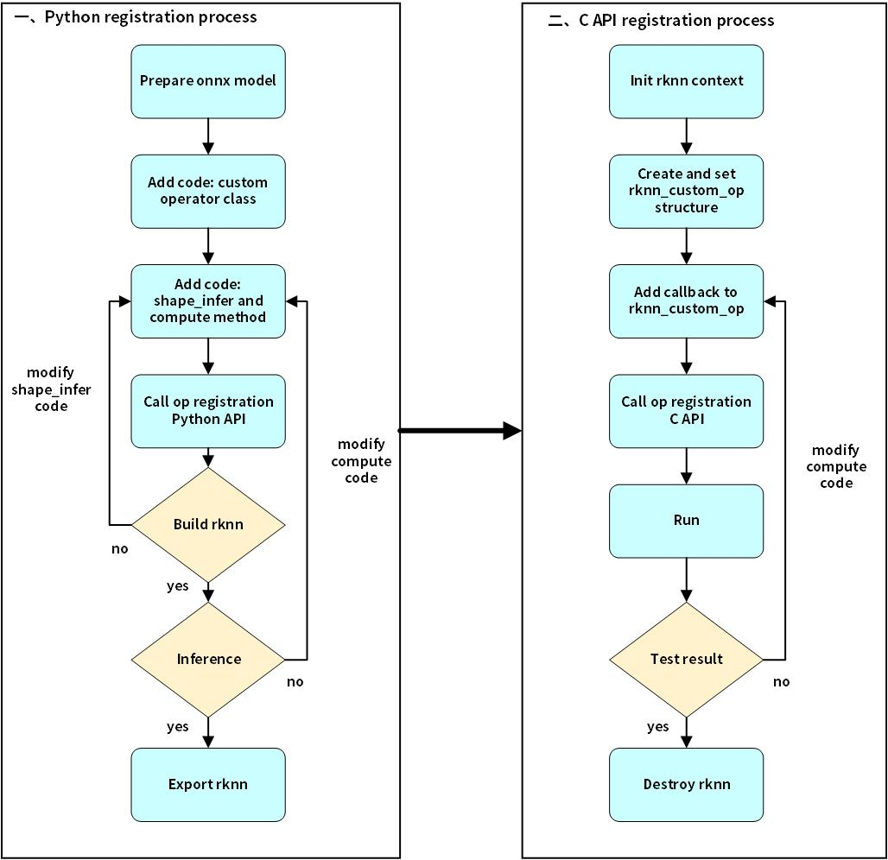
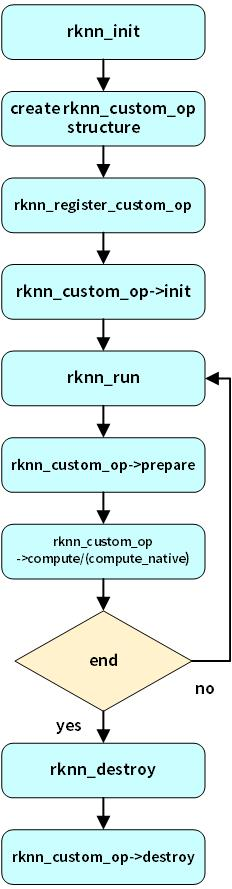

# 自定义算子介绍
自定义算子是深度学习框架的一种机制，它允许开发者在深度学习模型的推理阶段定义和执行自定义的算子或层。通过实现自定义算子，开发者可以扩展模型功能，并且针对特定硬件（CPU或者GPU）进行优化，以充分利用硬件资源并提高推理速度。同时，开发自定义算子需要深刻的理解深度学习计算原理和目标硬件平台的特性，以确保正确性和性能。

## 整体流程介绍


1. 准备onnx模型: 按照自定义算子ONNX spec规范, 开发者设计自定义算子的类型、名字、 属性、输入/输出数量,并将该算子插入到onnx中的拓扑图位置，此过程开发者需要使用onnx包提供的api来修改和导出onnx模型。
2. 实现自定义算子Python类, 类里包括shape_infer和compute两个成员函数, 并调用Toolkit2的api注册该算子。
3. Toolkit2仿真调试通过后,转换并生成rknn模型。
4. 加载rknn模型，初始化模型上下文，然后，创建自定义算子的上下文，设置自定义算子结构体，完成结构体的初始化、预处理、推理、销毁各个阶段的回调函数实现,其中推理回调函数是必须由客户填充, 最后, 调用自定义算子API注册四个回调函数和算子信息。
5. 上板调试,回调函数调试通过后，开启模型详细日志和Dump功能确认完整模型的正确性。


## C API处理

在得到带自定义算子的rknn模型后，开始调用C API部署。首先，自定义算子的结构体和接口位于rknn_custom_op.h头文件，开发者程序需要包含该头文件。注册使用自定义算子的流程如下图所示：



### 1. 初始化自定义算子结构体

创建rknn上下文后，开发者需要创建rknn_custom_op结构体，设置自定义算子信息。算子信息包含以下内容：
- version：算子的版本号
- target：算子的执行后端设备，目前支持CPU和GPU
- op_type: 算子的类型，与ONNX模型中的类型字段相同
- cl_kernel_name/cl_file_name/cl_build_options：在注册GPU算子时必须配置，它们分别表示客户OpenCL代码文件和核函数名，以及编译选项，以字符串形式传入。若是CPU算子，则无须配置
- init,compute, compute_native, prepare和destroy均是函数指针，要开发者实现该函数实体后，设置给rknn_custom_op结构体相应的函数指针

### 2. 创建自定义算子实现

- init和destroy回调执行一次,分别在rknn_register_custom_op和rknn_destory中执行。
- init,prepare和destroy回调函数为可选实现, compute和compute_native回调函数开发者必须实现其中一个。
- compute/compute_native是算子运算回调函数,prepare函数是预处理回调函数,每次rknn_run都会执行prepare和compute/compute_native回调,执行顺序是prepare在前, compute/compute_native在后。
- compute回调函数处理输入/输出都是NCHW的float32格式数据(onnx模型如果指定输入/输出为int64的数据类型，则int64格式数据), compute_native回调函数用于高性能推理场景,它直接取运行时前后层输入/输出。compute和compute_native回调函数只能执行其中一个,compute_native如果存在,则执行该回调,否则执行compute回调函数。

回调函数参数定义规范如下:
- rknn_custom_op_context* op_ctx: op回调函数的上下文信息
- rknn_custom_op_tensor* inputs: op输入tensor数据和信息
- uint32_t n_inputs: op输入个数
- rknn_custom_op_tensor* outputs: op输出tensor数据和信息
- uint32_t n_outputs: op输出个数

#### init回调函数
用于解析算子信息或初始化临时缓冲区或者输入/输出缓冲区buffer。例如
- 分配临时buffer
```
/**
 * CPU算子
 */
void custom_op_init_callback(rknn_custom_op_context* op_ctx, rknn_custom_op_tensor* inputs, uint32_t n_inputs,
                             rknn_custom_op_tensor* outputs, uint32_t n_outputs)
{
  printf("custom_op_init_callback\n");
  // create tmp buffer
  float* tmp_buffer = (float*)malloc(inputs[0].n_elems * sizeof(float));
  op_ctx->priv_data = tmp_buffer;
}
/**
 * GPU算子
 * */
void relu_init_callback_gpu(rknn_custom_op_context* op_ctx, rknn_custom_op_tensor* inputs, uint32_t n_inputs,
                            rknn_custom_op_tensor* outputs, uint32_t n_outputs)
{
  printf("relu_init_callback_gpu\n");
  // 获取opencl context
  cl_context cl_ctx = (cl_context)op_ctx->gpu_ctx.cl_context;

  // create tmp cl buffer
  cl_mem* memObject = (cl_mem*)malloc(sizeof(cl_mem) * 2);
  memObject[0]      = clCreateBuffer(cl_ctx, CL_MEM_READ_WRITE, inputs[0].size, NULL, NULL);
  memObject[1]      = clCreateBuffer(cl_ctx, CL_MEM_READ_WRITE, outputs[0].size, NULL, NULL);
  op_ctx->priv_data = memObject;
}
```

#### prepare回调函数
该回调函数每帧推理都会调用，目前为预留实现。


#### compute回调函数
它是自定义算子的计算函数,开发者必须完成输入/输出是NCHW或UNDEFINED格式float32数据类型输入输出的核函数,

##### 1. compute回调（CPU）
假设开发者想实现一个自定义层，完成softmax功能，CPU算子compute函数示例如下：

```
/**
 * float32 kernel implementation sample for custom op
 * */
void compute_custom_softmax_float32(rknn_custom_op_context* op_ctx, rknn_custom_op_tensor* inputs, uint32_t n_inputs,
                                    rknn_custom_op_tensor* outputs, uint32_t n_outputs)
{
  // // read input/output info
  // for (int i = 0; i < n_inputs; ++i) {
  //   dump_tensor_info(&inputs[i]);
  // }
  // for (int i = 0; i < n_outputs; ++i) {
  //   dump_tensor_info(&outputs[i]);
  // }
  unsigned char*      in_ptr   = (unsigned char*)inputs[0].virt_addr + inputs[0].offset;
  unsigned char*      out_ptr  = (unsigned char*)outputs[0].virt_addr + outputs[0].offset;
  int                 axis     = 0;
  const float*        in_data  = (const float*)in_ptr;
  float*              out_data = (float*)out_ptr;
  std::string         name     = "";
  rknn_custom_op_attr op_name;
  rknn_custom_op_get_op_attr(op_ctx, "name", &op_name);
  if (op_name.n_elems > 0 && op_name.dtype == RKNN_TENSOR_UINT8) {
    name = (char*)op_name.data;
  }

  rknn_custom_op_attr op_attr;
  rknn_custom_op_get_op_attr(op_ctx, "axis", &op_attr);
  if (op_attr.n_elems == 1 && op_attr.dtype == RKNN_TENSOR_INT64) {
    axis = ((int64_t*)op_attr.data)[0];
  }

  printf("op name = %s, axis = %d\n", name.c_str(), axis);
  float* tmp_buffer = (float*)op_ctx->priv_data;
  // kernel implementation for custom op
  {
    int inside  = 1;
    int outside = 1;
    int channel = 1;

    while (axis < 0) {
      axis += inputs[0].n_dims;
    }

    for (int i = 0; i < axis; i++) {
      outside *= inputs[0].dims[i];
    }
    channel = inputs[0].dims[axis];
    for (int i = axis; i < inputs[0].n_dims; i++) {
      inside *= inputs[0].dims[i];
    }

    for (int y = 0; y < outside; y++) {
      const float* src_y    = in_data + y * inside;
      float*       dst_y    = out_data + y * inside;
      float        max_data = -FLT_MAX;
      float        sum_data = 0.0f;

      for (int i = 0; i < inside; ++i) {
        max_data = fmaxf(max_data, src_y[i]);
      }
      for (int i = 0; i < inside; ++i) {
        tmp_buffer[i] = expf(src_y[i] - max_data);
        sum_data += tmp_buffer[i];
      }
      for (int i = 0; i < inside; ++i) {
        dst_y[i] = tmp_buffer[i] / sum_data;
      }
    }
  }
}
```

- 算子上下文参数
  - rknn_custom_op_context：包含target（执行后端设备）、gpu上下文、自定义算子私有上下文以及priv_data，其中priv_data的生命周期由开发者管理
  - gpu上下文包含cl_context、cl_command_queue、cl_kernel指针，可以通过强制类型转换得到对应的OpenCL对象
- 算子的输入/输出tensor参数
  - rknn_custom_op_tensor: 表示输入/输出tensor的信息,包含tensor的名称、形状、大小、量化参数、虚拟基地址、fd、数据偏移等信息。**有效数据地址=虚拟地址+偏移，大小和偏移都以字节为单位**
- 算子属性信息
  - 开发者通过调用rknn_custom_op_get_op_attr接口传入属性字段获得属性信息，属性信息用rknn_custom_op_attr表示，rknn_custom_op_attr中的void类型buffer，dtype以及元素数量表示一块内存段，开发者根据dtype使用C/C++将buffer强制转换指针类型可以得到相应数值类型的数组。

##### 2. compute回调函数（GPU）

对于GPU算子，开发者要在回调函数中完成以下步骤：
- 开发者从rknn_custom_op_context里的gpu_ctx中获取opencl的cl_context， cl_command_queue以及cl_kernel对象，此过程需要开发者做数据类型转换。
- 如有必要，读写或者import op输入或输出的cl_mem
- 设置cl_kernel的函数参数
- 以阻塞的形式运行cl_kernel

```
/**
 * opencl kernel init callback for custom op
 * */
void compute_custom_relu_float32(rknn_custom_op_context* op_ctx, rknn_custom_op_tensor* inputs, uint32_t num_inputs,
                                 rknn_custom_op_tensor* outputs, uint32_t num_outputs)
{
  // // dump input/output tensor info
  // dump_tensor_info(inputs);
  // dump_tensor_info(outputs);

  std::string         name = "";
  rknn_custom_op_attr op_name;
  rknn_custom_op_get_op_attr(op_ctx, "name", &op_name);
  if (op_name.n_elems > 0 && op_name.dtype == RKNN_TENSOR_UINT8) {
    name = (char*)op_name.data;
  }

  // // save input npy
  // char output_path[PATH_MAX];
  // sprintf(output_path, "%s/opencl_input%d.npy", ".", 0);
  // save_npy(output_path, &inputs[0]);

  // get context
  cl_context cl_ctx = (cl_context)op_ctx->gpu_ctx.cl_context;

  // get command queue
  cl_command_queue queue = (cl_command_queue)op_ctx->gpu_ctx.cl_command_queue;

  // get kernel
  cl_kernel kernel = (cl_kernel)op_ctx->gpu_ctx.cl_kernel;

  // import input/output buffer
  const cl_import_properties_arm props[3] = {
    CL_IMPORT_TYPE_ARM,
    CL_IMPORT_TYPE_DMA_BUF_ARM,
    0,
  };

  cl_int status;
  cl_mem inObject =
    clImportMemoryARM(cl_ctx, CL_MEM_READ_WRITE, props, &inputs[0].fd, inputs[0].offset + inputs[0].size, &status);
  if (status != CL_SUCCESS) {
    printf("Tensor: %s clImportMemoryARM failed\n", inputs[0].name);
  }
  cl_mem outObject =
    clImportMemoryARM(cl_ctx, CL_MEM_READ_WRITE, props, &outputs[0].fd, outputs[0].offset + outputs[0].size, &status);
  if (status != CL_SUCCESS) {
    printf("Tensor: %s clImportMemoryARM failed\n", outputs[0].name);
  }

  int          in_type_bytes  = get_type_bytes(inputs[0].type);
  int          out_type_bytes = get_type_bytes(outputs[0].type);
  int          in_offset      = inputs[0].offset / in_type_bytes;
  int          out_offset     = outputs[0].offset / out_type_bytes;
  unsigned int elems          = inputs[0].n_elems;

  // set kernel args
  int argIndex = 0;
  clSetKernelArg(kernel, argIndex++, sizeof(cl_mem), &inObject);
  clSetKernelArg(kernel, argIndex++, sizeof(cl_mem), &outObject);
  clSetKernelArg(kernel, argIndex++, sizeof(int), &in_offset);
  clSetKernelArg(kernel, argIndex++, sizeof(int), &out_offset);
  clSetKernelArg(kernel, argIndex++, sizeof(unsigned int), &elems);

  // set global worksize
  const size_t global_work_size[3] = {elems, 1, 1};

  // enqueueNDRangeKernel
  clEnqueueNDRangeKernel(queue, kernel, 1, NULL, global_work_size, NULL, 0, NULL, NULL);

  // finish command queue
  clFinish(queue);
}
```


#### compute_native回调函数

compute_native函数内查到的输入/输出layout和数据类型是RKNN模型运行到该层时性能最优的输入/输出layout和数据类型。通常有以下几种layout:
1. UNDEFINED:形状是非4维度的Tensor的layout
2. NCHW: CPU/GPU运算层的输入或者输出
3. NC1HWC2: NPU运算层的输入或者输出，数据排布请参考《C API零拷贝的后处理章节》


#### destroy回调函数
用于销毁自定义算子的临时缓冲区或输入/输出buffer，例如
- 销毁临时buffer

```
/**
 * CPU算子
 */
void custom_op_destroy_callback(rknn_custom_op_context* op_ctx)
{
  printf("custom_op_destroy_callback\n");
  // clear tmp buffer
  free(op_ctx->priv_data);
}
/**
 * GPU算子
 */
void relu_destroy_callback_gpu(rknn_custom_op_context* op_ctx)
{
  // clear tmp buffer
  printf("relu_destroy_callback_gpu\n");
  cl_mem* memObject = (cl_mem*)op_ctx->priv_data;
  clReleaseMemObject(memObject[0]);
  clReleaseMemObject(memObject[1]);
  free(memObject);
}

```

### 3. 注册自定义算子
在设置完rknn_custom_op结构体后，需要调用rknn_register_custom_op将其注册到rknn_context中，代码示例如下：
```
  // register a custom op
  rknn_custom_op user_op;
  memset(&user_op, 0, sizeof(rknn_custom_op));
  strncpy(user_op.op_type, "cstSoftmax", RKNN_MAX_NAME_LEN - 1);
  user_op.version = 1;
  user_op.target  = RKNN_TARGET_TYPE_CPU;
  user_op.init    = custom_op_init_callback;
  if (use_native_dtype == 0) {
    user_op.compute = compute_custom_softmax_float32;
  } else {
    user_op.compute_native = compute_custom_relu_use_native_dtype;
  }
  user_op.destroy = custom_op_destroy_callback;

  ret = rknn_register_custom_op(ctx, &user_op);
  if (ret < 0) {
    printf("rknn_register_custom_op fail! ret = %d\n", ret);
    return -1;
  }

```
每个类型的自定义算子要调用一次注册接口，网络中同一类型的算子仅调用一次。

### 4. 模型推理
在注册完所有算子后，可以使用通用API或零拷贝API流程完成推理
