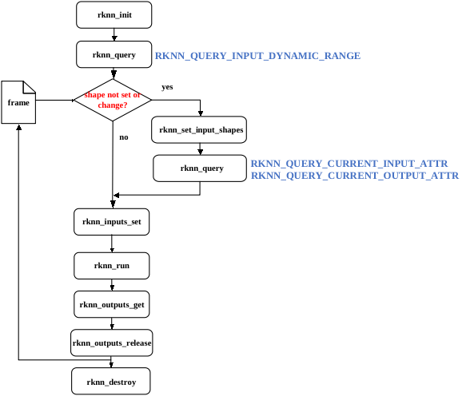
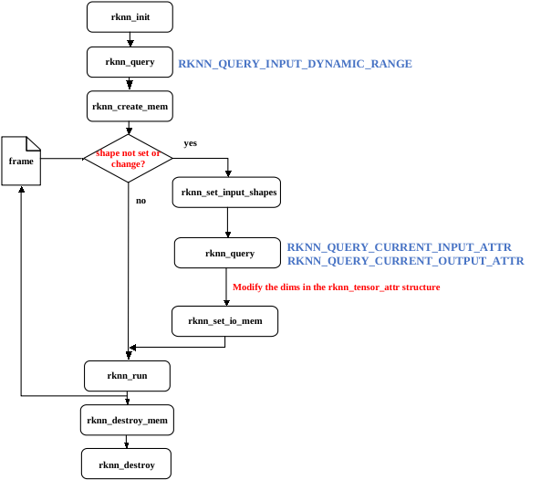

# 动态shape功能介绍
动态shape是指模型输入数据的形状在运行时可以改变。它可以帮助处理输入数据大小不固定的情况，增加模型的灵活性。在之前仅支持静态shape的rknn模型情况下，如果用户需要使用多个输入shape，传统的做法是生成多个rknn模型，在模型部署时初始化多个上下文分别执行推理，而在引入动态shape后，用户可以只保留一份与静态shape rknn模型大小接近的动态shape rknn模型，并使用一个上下文进行推理，从而节省Flash占用和DDR占用，动态shape在图像处理和序列模型推理中具有重要的作用，它的典型应用场景包括：

- 序列长度改变的模型，常见于NLP模型，例如BERT, GPT
- 空间维度变化的模型，例如分割和风格迁移
- 带Batch模型，Batch维度上变化
- 可变输出数量的目标检测模型


##  RKNN SDK版本和平台要求
* RKNN-Toolkit2版本>=1.5.0
* RKNPU Runtime库(librknnrt.so)版本>=1.5.0
* RK3566/RK3568/RK3588/RK3588S/RK3562平台的NPU支持该功能


## 生成动态shape的rknn
下面介绍使用RKNN-Toolkit2的python接口生成动态shape的rknn模型的步骤：

### 1. 确认模型支持动态shape
如果模型文件本身不是动态shape, RKNN-Toolkit2支持扩展成动态shape的rknn模型。首先，用户要确认模型本身不存在限制动态shape的算子或子图结构，例如，常量的形状无法改变，RKNN-Toolkit2工具在转换过程会报错，如果遇到不支持动态shape扩展的情况，用户要根据报错信息，修改模型结构，重新训练模型以支持动态shape。建议使用原始模型本身就是动态shape的模型。

### 2. 设置需要使用的输入形状
由于NPU硬件特性，动态shape rknn模型不支持输入形状任意改变，要求用户设置有限个输入形状。对于多输入的模型，每个输入的形状个数要相同。例如，在使用RKNN-Toolkit2转换Caffe模型时，python代码示例如下：
```
    dynamic_input = [
        [[1,3,224,224]],    # set the first shape for all inputs
        [[1,3,192,192]],    # set the second shape for all inputs
        [[1,3,160,160]],    # set the third shape for all inputs
    ]

    # Pre-process config
    rknn.config(mean_values=[103.94, 116.78, 123.68], std_values=[58.82, 58.82, 58.82], quant_img_RGB2BGR=True, dynamic_input=dynamic_shapes)
```
上述接口配置会生成支持3个形状分别是[1,3,224,224]、[1,3,192,192]和[1,3,160,160]的动态shape rknn模型。

dynamic_input中的shape与原始模型框架的layout一致，例如，对于相同的224x224大小的RGB图片做分类，TensorFlow/TFLite模型输入是[1,224,224,3]，而ONNX模型输入是[1,3,224,224]。

### 3. 量化
在设置好输入形状后， 如果要做量化，则设置量化矫正集数据。工具会读取用户设置的最大分辨率输入做量化（**最大分辨率**是所有输入尺寸之和的最大的一组形状）。
- 如果量化矫正集是jpg/png图片格式，用户可以使用不同的分辨率的图片做量化，因为工具会对图片使用opencv的resize方法缩放到最大分辨率后做量化。
- 如果量化矫正集是npy格式，则用户必须使用最大分辨率输入的形状。量化后，模型内所有形状在运行时使用同一套量化参数进行推理。

### 4. 推理评估或精度分析
动态shape推理或做精度分析时，用户必须提供第2步中设置的其中一种输入形状的输入，接口使用上与静态shape rknn模型场景一致，此处不做赘述。

完整的创建动态shape rknn模型示例，请参考[动态shape rknn模型转换](https://github.com/rockchip-linux/rknn-toolkit2/tree/master/examples/functions/dynamic_shape)

## C API部署
得到动态shapeRKNN模型后，接下来开始使用RKNPU C API进行部署。按照接口形式，分为通用API和零拷贝API流程。

### 一、通用API

加载动态形状输入RKNN模型后，可以在运行时动态修改输入的形状。首先，通过rknn_query可以查询RKNN模型支持的输入形状列表,每个输入支持的形状列表信息以rknn_input_range结构体形式返回，它包含了每个输入的名称、数据布局信息、形状个数以及具体形状。接着，通过调用rknn_set_input_shapes接口，传入包含每个输入形状信息的rknn_tensor_attr数组指针可以设置当前推理使用的形状。在设置输入形状后，可以再次调用rknn_query查询当前设置成功后的输入和输出形状。
最后，按照通用API流程完成推理。每次切换输入形状时，需要再设置一次新的形状，准备新形状大小的数据并再次调用rknn_inputs_set接口。如果推理前不需要切换输入形状，无需重复调用rknn_set_input_shapes接口。调用流程如下图所示：



#### 1. 初始化
调用rknn_init接口初始化动态shape rknn模型，
对于动态shape rknn模型，在init接口使用上有如下限制：
- 不支持用户使用外部接口分配内存的零拷贝流程。
- 不支持带RKNN_FLAG_SHARE_WEIGHT_MEM标志的初始化。
- 不支持rknn_dup_context接口。


#### 2. 查询RKNN模型支持的输入形状组合
初始化成功后，通过rknn_query可以查询到RKNN模型支持的输入形状列表,每个输入支持的形状列表信息以rknn_input_range结构体形式返回，它包含了每个输入的名称，layout信息，支持的形状个数以及具体形状。C代码示例如下：
```
    // 查询模型支持的输入形状
    rknn_input_range dyn_range[io_num.n_input];
    memset(dyn_range, 0, io_num.n_input * sizeof(rknn_input_range));
    for (uint32_t i = 0; i < io_num.n_input; i++)
    {
        dyn_range[i].index = i;
        ret = rknn_query(ctx, RKNN_QUERY_INPUT_DYNAMIC_RANGE, &dyn_range[i], sizeof(rknn_input_range));
        if (ret != RKNN_SUCC)
        {
            fprintf(stderr, "rknn_query error! ret=%d\n", ret);
            return -1;
        }
        dump_input_dynamic_range(&dyn_range[i]);
    }
```
注意：对于多输入的模型，所有输入的形状按顺序一一对应，例如，假设有两个输入、多种形状的rknn模型，第一个输入的第一个形状与第二个输入的第一个形状组合有效，不存在交叉的形状组合。


#### 3.设置输入形状
加载动态shape rknn模型后，您可以在运行时动态修改输入的形状。通过调用rknn_set_input_shapes接口，传入所有输入的rknn_tensor_attr数组，每个rknn_tensor_attr中的dims,n_dims和fmt三个成员信息表示了当前次推理的形状。例如，使用rknn_query获取的输入形状设置输入时，C代码示例如下：

```
    for (int s = 0; s < shape_num; ++s)
    {
        for (int i = 0; i < io_num.n_input; i++)
        {
            for (int j = 0; j < input_attrs[i].n_dims; ++j)
            {
                input_attrs[i].dims[j] = shape_range[i].dyn_range[s][j];
            }
        }
        ret = rknn_set_input_shapes(ctx, io_num.n_input, input_attrs);
        if (ret < 0)
        {
            fprintf(stderr, "rknn_set_input_shapes error! ret=%d\n", ret);
            return -1;
        }
    }
```
其中，shape_num是支持的形状个数，shape_range[i].dyn_range[s]是第i个输入的第s个形状，io_num.n_input是输入数量,input_attrs是模型所有输入的rknn_tensor_attr结构体数组。

在设置输入形状后，可以再次调用rknn_query查询当前次推理成功设置后的输入和输出形状，C代码示例如下：
```
        // 获取当前次推理的输入和输出形状
        rknn_tensor_attr cur_input_attrs[io_num.n_input];
        memset(cur_input_attrs, 0, io_num.n_input * sizeof(rknn_tensor_attr));
        for (uint32_t i = 0; i < io_num.n_input; i++)
        {
            cur_input_attrs[i].index = i;
            ret = rknn_query(ctx, RKNN_QUERY_CURRENT_INPUT_ATTR, &(cur_input_attrs[i]), sizeof(rknn_tensor_attr));
            if (ret < 0)
            {
                printf("rknn_init error! ret=%d\n", ret);
                return -1;
            }
            dump_tensor_attr(&cur_input_attrs[i]);
        }

        rknn_tensor_attr cur_output_attrs[io_num.n_output];
        memset(cur_output_attrs, 0, io_num.n_output * sizeof(rknn_tensor_attr));
        for (uint32_t i = 0; i < io_num.n_output; i++)
        {
            cur_output_attrs[i].index = i;
            ret = rknn_query(ctx, RKNN_QUERY_CURRENT_OUTPUT_ATTR, &(cur_output_attrs[i]), sizeof(rknn_tensor_attr));
            if (ret != RKNN_SUCC)
            {
                printf("rknn_query fail! ret=%d\n", ret);
                return -1;
            }
            dump_tensor_attr(&cur_output_attrs[i]);
        }
```
- 注意事项：
1. rknn_set_input_shapes要求支持输入tensor的fmt=NHWC或者UNDEFINED类型,如果输入是4维，使用NHWC; 否则使用UNDEFINED。

2. rknn_query接口命令的RKNN_QUERY_CURRENT_INPUT_ATTR和RKNN_QUERY_CURRENT_NATIVE_INPUT_ATTR区别在于， 前者获取原始模型NHWC或者UNDEFINED的输入形状，后者获取的是NPU以最优性能读取数据的的输入形状（可能是NHWC或者NC1HWC2）。RKNN_QUERY_CURRENT_OUTPUT_ATTR和RKNN_QUERY_CURRENT_NATIVE_OUTPUT_ATTR命令获取的输出形状区别也是如此。
3. 在rknn_set_input_shapes尚未调用前，使用带RKNN_QUERY_CURRENT前缀的命令查询的形状信息是无效的。


#### 4.推理
在设置好当前输入形状后，假设输入Tensor的形状信息保存在cur_input_attrs数组中，以通用API接口为例，C代码示例如下：

```
    // 设置输入信息
    rknn_input inputs[io_num.n_input];
    memset(inputs, 0, io_num.n_input * sizeof(rknn_input));
    for (int i = 0; i < io_num.n_input; i++)
    {
        int height = cur_input_attrs[i].fmt == RKNN_TENSOR_NHWC ? cur_input_attrs[i].dims[1] : cur_input_attrs[i].dims[2];
        int width = cur_input_attrs[i].fmt == RKNN_TENSOR_NHWC ? cur_input_attrs[i].dims[2] : cur_input_attrs[i].dims[3];
        cv::resize(imgs[i], imgs[i], cv::Size(width, height));
        inputs[i].index = i;
        inputs[i].pass_through = 0;
        inputs[i].type = RKNN_TENSOR_UINT8;
        inputs[i].fmt = RKNN_TENSOR_NHWC;
        inputs[i].buf = imgs[i].data;
        inputs[i].size = imgs[i].total() * imgs[i].channels();
    }

    // 将输入数据转换成正确的格式后，放到输入缓冲区
    ret = rknn_inputs_set(ctx, io_num.n_input, inputs);
    if (ret < 0)
    {
        printf("rknn_input_set fail! ret=%d\n", ret);
        return -1;
    }

    // 进行推理
    printf("Begin perf ...\n");
    double total_time = 0;
    for (int i = 0; i < loop_count; ++i)
    {
        int64_t start_us = getCurrentTimeUs();
        ret = rknn_run(ctx, NULL);
        int64_t elapse_us = getCurrentTimeUs() - start_us;
        if (ret < 0)
        {
            printf("rknn run error %d\n", ret);
            return -1;
        }
        total_time += elapse_us / 1000.f;
        printf("%4d: Elapse Time = %.2fms, FPS = %.2f\n", i, elapse_us / 1000.f, 1000.f * 1000.f / elapse_us);
    }
    printf("Avg FPS = %.3f\n", loop_count * 1000.f / total_time);

    // 获取输出结果
    rknn_output outputs[io_num.n_output];
    memset(outputs, 0, io_num.n_output * sizeof(rknn_output));
    for (uint32_t i = 0; i < io_num.n_output; ++i)
    {
        outputs[i].want_float = 1;
        outputs[i].index = i;
        outputs[i].is_prealloc = 0;
    }

    ret = rknn_outputs_get(ctx, io_num.n_output, outputs, NULL);
    if (ret < 0)
    {
        printf("rknn_outputs_get fail! ret=%d\n", ret);
        return ret;
    }

    //释放输出缓冲区buffer
    ret = rknn_outputs_release(ctx, io_num.n_output, outputs);
```


### 二、零拷贝API

对于零拷贝API而言，初始化成功后，通过rknn_query可以查询RKNN模型支持的输入形状列表，调用rknn_create_mem接口分配**最大形状**的输入和输出内存。接着，通过调用rknn_set_input_shapes接口，传入包含每个输入形状信息的rknn_tensor_attr数组指针可以设置当前推理使用的形状。在设置输入形状后，可以再次调用rknn_query查询设置成功后的输入和输出形状。最后，调用rknn_set_io_mem接口设置需要的输入输出内存。每次切换输入形状时，需要再设置一次新的形状，准备新形状大小的数据并再次调用rknn_set_io_mem接口，如果推理前不需要切换输入形状，无需重复调用rknn_set_input_shapes接口。典型用法流程如下图所示：




初始化、查询RKNN模型支持的输入形状组合、设置输入形状使用与上述通用API相同，此处不做赘述。不同之处在于，在设置输入形状后，使用的接口不同。零拷贝推理C代码示例如下：

```
    // 创建最大的输入tensor内存
    rknn_tensor_mem *input_mems[io_num.n_input];
    for (int i = 0; i < io_num.n_input; i++)
    {
        // default input type is int8 (normalize and quantize need compute in outside)
        // if set uint8, will fuse normalize and quantize to npu
        input_attrs[i].type = RKNN_TENSOR_UINT8;
        // default fmt is NHWC, npu only support NHWC in zero copy mode
        input_attrs[i].fmt = RKNN_TENSOR_NHWC;

        input_mems[i] = rknn_create_mem(ctx, input_attrs[i].size_with_stride);
    }

    // 创建最大的输出tensor内存
    rknn_tensor_mem *output_mems[io_num.n_output];
    for (uint32_t i = 0; i < io_num.n_output; ++i)
    {
        // default output type is depend on model, this require float32 to compute top5
        // allocate float32 output tensor
        int output_size = output_attrs[i].size * sizeof(float);
        output_mems[i] = rknn_create_mem(ctx, output_size);
    }

    // 加载输入并设置模型输入形状，每次切换输入形状要调用一次
    for (int s = 0; s < shape_num; ++s)
    {
        for (int i = 0; i < io_num.n_input; i++)
        {
            for (int j = 0; j < input_attrs[i].n_dims; ++j)
            {
                input_attrs[i].dims[j] = shape_range[i].dyn_range[s][j];
            }
        }
        ret = rknn_set_input_shapes(ctx, io_num.n_input, input_attrs);
        if (ret < 0)
        {
            fprintf(stderr, "rknn_set_input_shape error! ret=%d\n", ret);
            return -1;
        }

        // 获取当前次推理的输入和输出形状
        printf("current input tensors:\n");
        rknn_tensor_attr cur_input_attrs[io_num.n_input];
        memset(cur_input_attrs, 0, io_num.n_input * sizeof(rknn_tensor_attr));
        for (uint32_t i = 0; i < io_num.n_input; i++)
        {
            cur_input_attrs[i].index = i;
            // query info
            ret = rknn_query(ctx, RKNN_QUERY_CURRENT_INPUT_ATTR, &(cur_input_attrs[i]), sizeof(rknn_tensor_attr));
            if (ret < 0)
            {
                printf("rknn_init error! ret=%d\n", ret);
                return -1;
            }
            dump_tensor_attr(&cur_input_attrs[i]);
        }

        printf("current output tensors:\n");
        rknn_tensor_attr cur_output_attrs[io_num.n_output];
        memset(cur_output_attrs, 0, io_num.n_output * sizeof(rknn_tensor_attr));
        for (uint32_t i = 0; i < io_num.n_output; i++)
        {
            cur_output_attrs[i].index = i;
            // query info
            ret = rknn_query(ctx, RKNN_QUERY_CURRENT_OUTPUT_ATTR, &(cur_output_attrs[i]), sizeof(rknn_tensor_attr));
            if (ret != RKNN_SUCC)
            {
                printf("rknn_query fail! ret=%d\n", ret);
                return -1;
            }
            dump_tensor_attr(&cur_output_attrs[i]);
        }

        // 指定NPU核心数量，仅3588支持
        rknn_set_core_mask(ctx, (rknn_core_mask)core_mask);

        // 设置输入信息
        rknn_input inputs[io_num.n_input];
        memset(inputs, 0, io_num.n_input * sizeof(rknn_input));
        std::vector<cv::Mat> resize_imgs;
        resize_imgs.resize(io_num.n_input);
        for (int i = 0; i < io_num.n_input; i++)
        {
            int height = cur_input_attrs[i].fmt == RKNN_TENSOR_NHWC ? cur_input_attrs[i].dims[1] : cur_input_attrs[i].dims[2];
            int width = cur_input_attrs[i].fmt == RKNN_TENSOR_NHWC ? cur_input_attrs[i].dims[2] : cur_input_attrs[i].dims[3];
            int stride = cur_input_attrs[i].w_stride;
            cv::resize(imgs[i], resize_imgs[i], cv::Size(width, height));
            int input_size = resize_imgs[i].total() * resize_imgs[i].channels();
            // 拷贝外部数据到零拷贝输入缓冲区
            if (width == stride)
            {
                memcpy(input_mems[i]->virt_addr, resize_imgs[i].data, input_size);
            }
            else
            {
                int height = cur_input_attrs[i].dims[1];
                int channel = cur_input_attrs[i].dims[3];
                // copy from src to dst with stride
                uint8_t *src_ptr = resize_imgs[i].data;
                uint8_t *dst_ptr = (uint8_t *)input_mems[i]->virt_addr;
                // width-channel elements
                int src_wc_elems = width * channel;
                int dst_wc_elems = stride * channel;
                for (int b = 0; b < cur_input_attrs[i].dims[0]; b++)
                {
                    for (int h = 0; h < height; ++h)
                    {
                        memcpy(dst_ptr, src_ptr, src_wc_elems);
                        src_ptr += src_wc_elems;
                        dst_ptr += dst_wc_elems;
                    }
                }
            }
        }

        // 更新输入零拷贝缓冲区内存
        for (int i = 0; i < io_num.n_input; i++)
        {
            cur_input_attrs[i].type = RKNN_TENSOR_UINT8;
            ret = rknn_set_io_mem(ctx, input_mems[i], &cur_input_attrs[i]);
            if (ret < 0)
            {
                printf("rknn_set_io_mem fail! ret=%d\n", ret);
                return -1;
            }
        }

        // 更新输出零拷贝缓冲区内存
        for (uint32_t i = 0; i < io_num.n_output; ++i)
        {
            // default output type is depend on model, this require float32 to compute top5
            cur_output_attrs[i].type = RKNN_TENSOR_FLOAT32;
            cur_output_attrs[i].fmt = RKNN_TENSOR_NCHW;
            // set output memory and attribute
            ret = rknn_set_io_mem(ctx, output_mems[i], &cur_output_attrs[i]);
            if (ret < 0)
            {
                printf("rknn_set_io_mem fail! ret=%d\n", ret);
                return -1;
            }
        }

        // 进行推理
        printf("Begin perf ...\n");
        double total_time = 0;
        for (int i = 0; i < loop_count; ++i)
        {
            int64_t start_us = getCurrentTimeUs();
            ret = rknn_run(ctx, NULL);
            int64_t elapse_us = getCurrentTimeUs() - start_us;
            if (ret < 0)
            {
                printf("rknn run error %d\n", ret);
                return -1;
            }
            total_time += elapse_us / 1000.f;
            printf("%4d: Elapse Time = %.2fms, FPS = %.2f\n", i, elapse_us / 1000.f, 1000.f * 1000.f / elapse_us);
        }
        printf("Avg FPS = %.3f\n", loop_count * 1000.f / total_time);

    }
```

- 注意事项：

1. rknn_set_io_mem接口在动态shape情况下，输入buffer的形状和大小说明：

   - 初始化完成后和调用rknn_set_input_shapes接口前，rknn_query接口使用RKNN_QUERY_INPUT_ATTR和RKNN_QUERY_OUTPUT_ATTR查询输入和输出Tensor的形状通常是最大的，用户可以使用这两个命令获取的大小来分配输入和输出内存。若遇到多输入模型，部分输入的形状可能不是最大的，此时需要搜索支持的形状中最大的规格，并分配最大的输入和输出内存。

   - 如果输入是非4维度，使用fmt=UNDEFINED，传递原始模型输入形状的buffer，大小则根据输入形状和type计算得到。

   - 如果输入是4维度，支持使用fmt=NHWC或者NC1HWC2， 传递NHWC或者NC1HWC2形状和对应size的buffer(通过rknn_query查询相应字段获取形状和size)。
   - 建议rknn_set_io_mem传入的fmt与rknn_query查询的fmt一致，即传递NHWC输入的buffer，则通过RKNN_QUERY_CURRENT_INPUT_ATTR获取当前输入形状;传递NC1HWC2的输入buffer，则通过RKNN_QUERY_CURRENT_NATIVE_INPUT_ATTR查询当前NPU读取性能最优的输入形状。


总之，RKNN动态shape可以帮助您处理可变大小的输入数据，提高模型的灵活性和效率。通过以上步骤，您可以使用RKNN C API进行动态shape的推理。完整的动态shapeC API Demo请参考[动态shape C API Demo](https://github.com/rockchip-linux/rknpu2/tree/master/examples/rknn_dynamic_shape_input_demo)