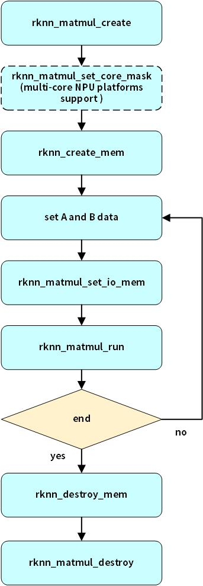

# Matmul API
Matmul API是Runtime提供的一套单独的C API，用于在NPU上运行矩阵乘法运算。矩阵乘法是线性代数中的一种重要操作，该操作定义如下：**C=AB**。
其中，A是一个M×K矩阵，B是一个K×N矩阵，C是一个M×N矩阵。

## 主要用途和特点

Matmul API多用于深度学习中的参数计算任务，例如，在大型预训练模型（如Transformer）中，自注意力机制使用大量矩阵乘法来计算注意力权重和上下文表示，它的性能对大模型的整体性能至关重要。它具有以下特点：

- **高效**：Matmul API底层使用NPU实现，具有高性能低功耗的特点。

- **灵活**：Matmul API无需加载rknn模型，支持int8和float16两种边缘端计算常用的数据类型，提供单独的内存分配接口或使用外部内存的机制，用户可管理和复用矩阵的输入输出内存。

## Matmul API使用流程

首先，Matmul API的结构体和接口位于rknn_matmul_api.h头文件，开发者程序编译时需要包含该头文件。Matmul API的流程如下图所示：

使用Matmul API通常包括以下步骤：

1. 创建上下文：设置rknn_matmul_info结构体，需设置M、K、N、输入矩阵的数据类型、输入、输出矩阵使用的数据排列方式，然后，调用rknn_matmul_create接口初始化上下文。在初始化后，获取以rknn_matmul_io_attr结构体指针，它包含了输入和输出矩阵Tensor信息。
2. 指定运行NPU核（仅RK3588平台有效）：调用rknn_matmul_set_core_mask，设置掩码来指定某一个NPU核做运算。
3. 创建输入和输出内存：调用rknn_matmul_create_mem接口，根据输入和输出矩阵Tensor信息中的大小创建内存。
4. 填充输入数据：根据形状和数据类型填充输入矩阵A和B的数据。
5. 设置输入和输出内存：调用rknn_matmul_set_io_mem将填充好数据的输入矩阵和记录到上下文中，输出内存也同样记录到上下文中。
6. 执行矩阵乘法运算：设置好输入和输出内存后，调用rknn_matmul_run执行矩阵乘法运算。
7. 处理输出：执行矩阵乘法运算后，从输出内存中读取结果。
8. 销毁资源：执行结束后，调用rknn_destroy_mem和rknn_matmul_destroy分别销毁内存和上下文资源。

## 矩阵乘法高级用法
在创建上下文时，要求用户设置rknn_matmul_info结构体，rknn_matmul_info表示用于执行矩阵乘法的规格信息，它包含了矩阵乘法的规模、输入和输出矩阵的数据类型和数据排列。其中，native_layout和perf_layout用于设置高性能的数据排列方式。具体的结构体定义如下表所示：

|成员变量|数据类型|	含义|
|--|--|--|
|M	|int32_t|A矩阵的行数|
|K|int32_t|A矩阵的列数|
|N|int32_t|B矩阵的列数|
|type|rknn_tensor_type|输入矩阵的数据类型|
|native_layout|int32_t|指定B矩阵的数据排列方式。0：表示矩阵B按照原始形状排列，1：表示矩阵B按照高性能形状排列|
|perf_layout|int32_t|指定矩阵A和矩阵C的数据排列方式。0：表示矩阵A和C按照原始形状排列，1：表示矩阵A和C按照高性能形状排列|

### 高性能的数据排列方式
由于NPU是专用的硬件架构，读取MxK和KxN这种原始形状的数据不是最高效的，同样的，写入MxN形状的C矩阵也不是最高效的，用户使用特殊的数据排列方式可以实现更高的性能。**perf_layout参数控制矩阵A和C是否使用高性能数据排列，native_layout参数控制矩阵B是否使用高性能数据排列**。

假设矩阵A的原始形状是MxK,矩阵B的原始形状是KxN，矩阵C的原始形状是MxN,要求的数据排列方式如下：
1. 若perf_layout=0且native_layout=0, 矩阵A的形状为[M,K]，矩阵B的形状为[K,N]，矩阵C的形状为[M,N]。
2. 若perf_layout=1且native_layout=1, 不同芯片平台和数据类型下矩阵A和C的高性能数据排列如下表所示（表中除法结果都是上取整，多出部分用0补齐）：

||RK3566/RK3568|RK3588|RK3562|
|-----|----|----|----|
|A形状(int8)|[K/8,M,8]|[K/16,M,16]|[K/16,M,16]|
|B形状(int8)|[N/16,K/32,16,32]|[N/32,K/32,32,32]|[N/16,K/32,16,32]|
|C形状(int32)|[K/8,M,8]|[K/16,M,16]|[K/16,M,16]|
|A形状(float16)|[K/4,M,4]|[K/8,M,8]|[K/8,M,8]|
|B形状(float16)|[N/8,K/16,8,16]|[N/16,K/32,16,32]|[N/8,K/32,8,32]|
|C形状(float32)|[K/4,M,4]|[K/8,M,8]|[K/8,M,8]|

**注**：
- perf_layout和native_layout可分别设置为0或1。若设置为0，则参数控制的矩阵按照原始形状排列；若设置为1，则参数控制的矩阵按照高性能形状排列。
- Matmul接口输入和输出的数据位宽不同，目前支持的几种矩阵数据类型如下表：

||矩阵A|矩阵B|矩阵C|
|-----|----|----|---|
|类型1|int8|int8|int32|
|类型2|float16|float16|float32|

其中，float16浮点格式遵循IEEE-754标准，具体格式请参考[IEEE-754 half](https://en.wikipedia.org/wiki/Half-precision_floating-point_format)
### 矩阵规格限制
Matmul API是基于NPU的硬件架构实现，受硬件规格限制。K和N大小限制如下：

||RK3566/RK3568|RK3588|RK3562|
|-----|----|----|----|
|K大小限制(int8)|<=4096且32对齐	|<=4096且32对齐|<=4096且32对齐|
|K大小限制(float16)|<=4096且32对齐	|<=4096且32对齐|<=4096且32对齐|
|N大小限制(int8)|<=4096且16对齐	|<=4096且32对齐|<=4096且16对齐|
|N大小限制(float16)|<=4096且16对齐	|<=4096且32对齐|<=4096且16对齐|