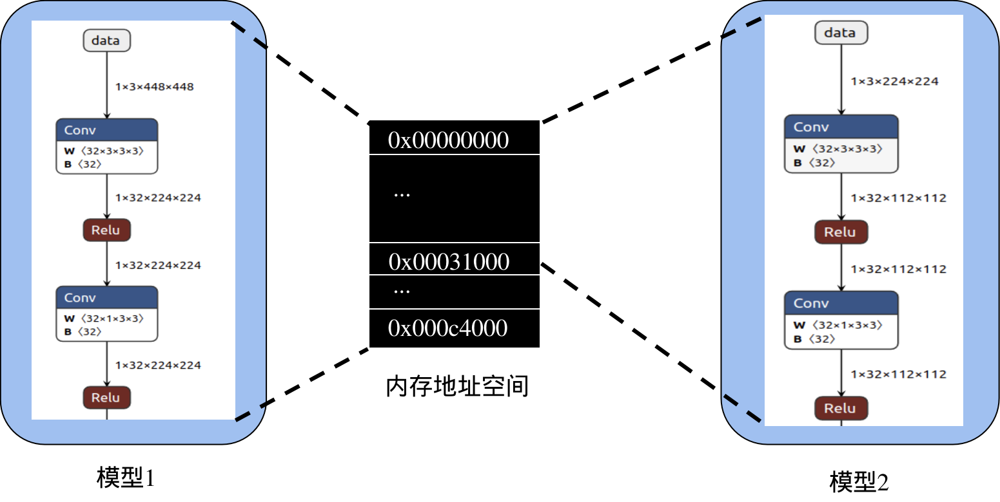
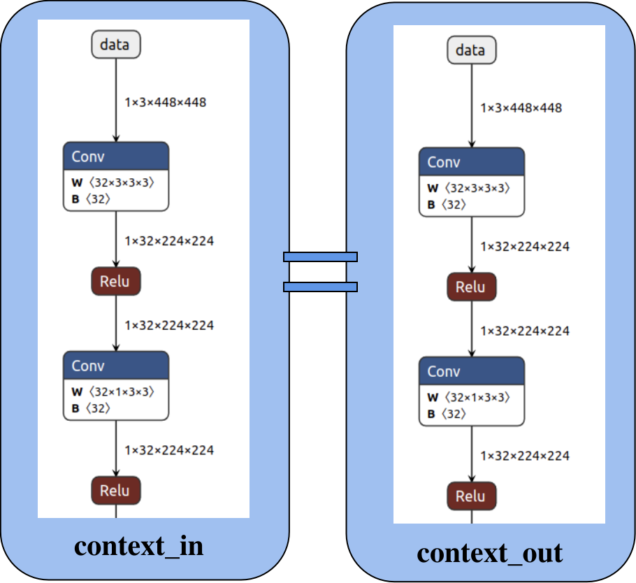
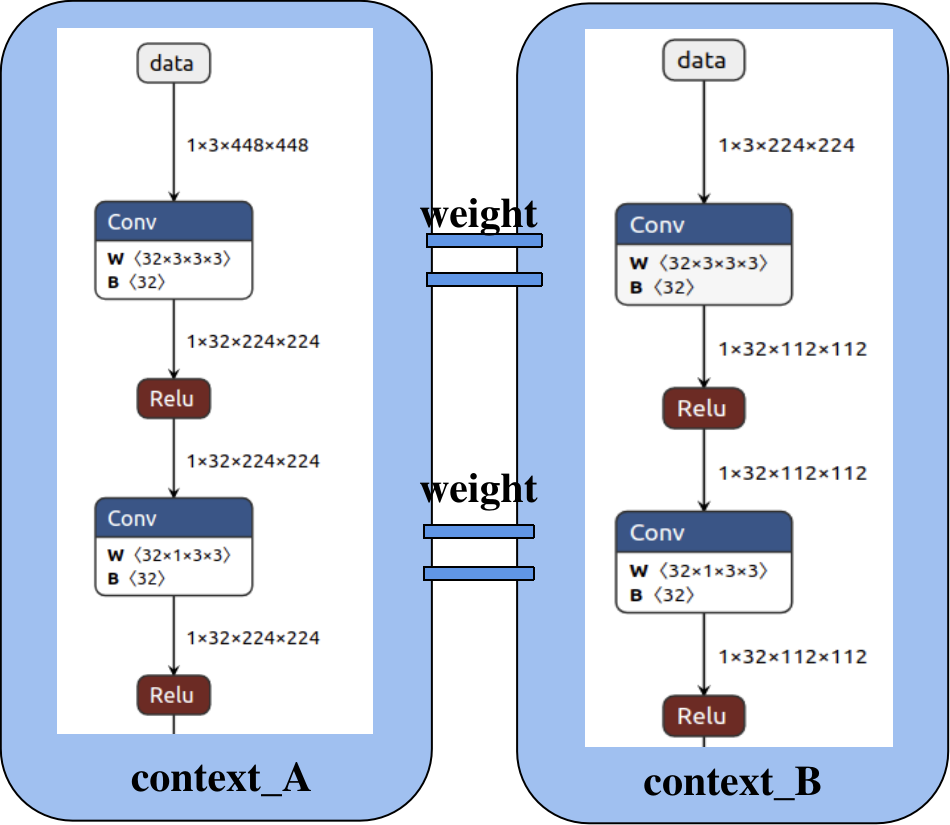

# 内存优化
## 模型内存组成及分析方法介绍
TODO

## 如何使用外部分配内存
TODO
## internal内存复用
RKNN API提供了外部管理NPU内存的机制，通过RKNN_FLAG_MEM_ALLOC_OUTSIDE参数，用户可以指定模型中间feature内存由外部分配。该用法典型的应用场景如下：
- 部署时，所有NPU内存均是用户自行分配，便于对整个系统内存进行统筹安排。
- 用于多个模型串行运行场景，中间feature内存在不同上下文复用，特别是针对RV1103/RV1106这种内存极为紧张的情况。

  例如，下图中有两个模型，模型1的中间feature占用大于模型2，如果模型1和模型2顺序地运行，可以只开辟0x00000000~0x000c4000地址的一块内存给模型1和2共用，模型1推理结束后，这块内存可以被模型2用来读写中间feature数据，从而节省内存。



假设模型1的路径是model_path_a，模型2路径是model_path_b，示例代码如下：
```
rknn_init(&ctx_a, model_path_a, 0, RKNN_FLAG_MEM_ALLOC_OUTSIDE, NULL);
rknn_query(ctx_a, RKNN_QUERY_MEM_SIZE, &mem_size_a, sizeof(mem_size_a));

rknn_init(&ctx_b, model_path_b, 0, RKNN_FLAG_MEM_ALLOC_OUTSIDE, NULL);
rknn_query(ctx_b, RKNN_QUERY_MEM_SIZE, &mem_size_b, sizeof(mem_size_b));

# 获取两个模型最大的internal size
max_internal_size = MAX(mem_size_a.total_internal_size, mem_size_b.total_internal_size);
internal_mem_max = rknn_create_mem(ctx_a, max_internal_size);
# 设置a模型internal memory
internal_mem_a = rknn_create_mem_from_fd(ctx_a, internal_mem_max->fd,
        	internal_mem_max->virt_addr, mem_size_a.total_internal_size, 0);
rknn_set_internal_mem(ctx_a, internal_mem_a);
# 设置b模型internal memory
internal_mem_b = rknn_create_mem_from_fd(ctx_b, internal_mem_max->fd,
        	internal_mem_max->virt_addr, mem_size_b.total_internal_size, 0);
rknn_set_internal_mem(ctx_b, internal_mem_b);

```

## 多线程复用上下文
在多线程场景中，一个模型可能会被多个线程同时执行，如果每个线程都单独初始化一个上下文，那么内存消耗会很大，因此可以考虑共享一个上下文，避免数据结构重复构造，减少运行时内存占用。RKNN API提供了复用上下文的接口，接口形式如下：
```
int rknn_dup_context(rknn_context* context_in,rknn_context* context_out)
```
其中，context_in是已初始化的上下文，而context_out是复用context_in的上下文。如下图所示，两个context的模型结构相同，有相同的图结构，因此可以复用上下文。
-



## 多分辨率模型共享相同权重

当多个不同分辨率模型有相同的权重时，可以共享相同的权重，以减少内存占用。此功能用于在RKNPU SDK<=1.5.0版本时，以较小的Flash和DDR占用实现动态切换分辨率。如下图所示，模型A和模型B的权重完全相同。

可按照以下步骤实现多分辨率模型共享相同权重：
1. 在转换RKNN模型时，其中一个模型设置为主模型，rknn.config接口设置参数`remove_weight=False`，另一个模型设置为从模型，设置参数`remove_weight=True`。主RKNN模型包含权重，从RKNN模型不包含卷积类权重。
2. 部署时，先初始化主RKNN模型，再初始化从RKNN模型。初始化从模型时，使用RKNN_FLAG_SHARE_WEIGHT_MEM标志，并新增rknn_init_extend参数，该参数主模型的上下文。假设主模型路径是model_A，从模型路径是model_B，示例代码如下：
```
rknn_context context_A;
rknn_context context_B;
ret = rknn_init(&context_A,model_A,0,0,NULL);
…
rknn_init_extend extend;
extend.ctx = context_A;
ret = rknn_init(&context_B, model_B,0,
RKNN_FLAG_SHARE_WEIGHT_MEM,&extend);

```

